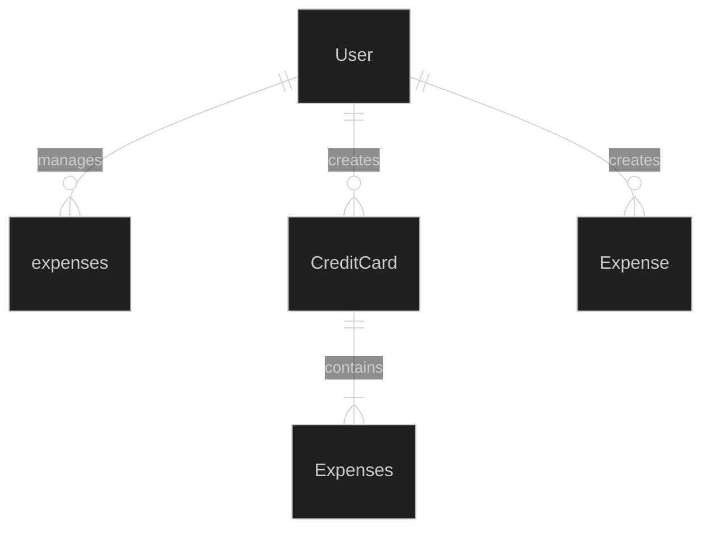
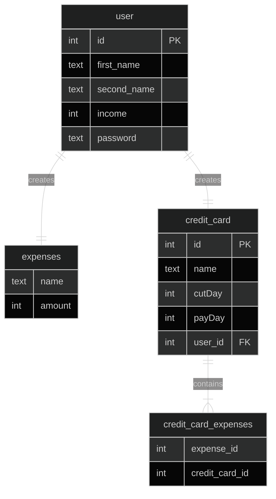

# track-expenses

# Overview

This repository contains an application to track and your monthly expenses

## Problem Definition

People don't use to track expenses, and every month expenses may increase, and if you have credit cards, having multiple ones could be confusing, this app will help the user to set a budget and have a list of your expenses.

## Priorities

### Must have

- A user must be able to log in
- A user must be able to add his monthly income
- A user must be able to add a credit card
- A user must be able to add an expense and link it to a credit card if it was made by one
- A user must be able to edit an expense

### Should have

- A user should be able to set a budget for the month
- A user should be able to see how much money is left according to the budget

### Could have

- The application could remind you the payment days of the credit cards

### Will not have

- Connect to bank apps

## Domain Model Diagram

### Entity Relationship Diagram

